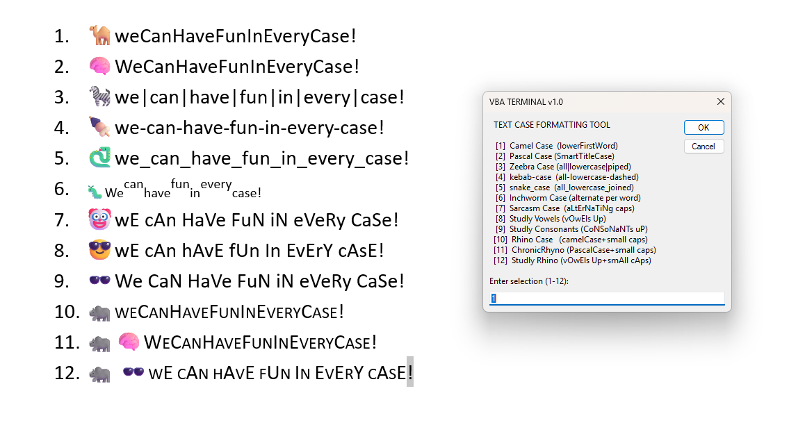

# VBA Terminal Text Formatting Tool

A collection of text formatting utilities for Microsoft Word, designed to honor traditional coding case styles and introduce experimental formats so we can have fun in any case.

This tool provides a terminal-style interface for transforming selected text into the following formats:

## 🏛️ Established Coding Styles
* 🐪 **Camel Case** (`lowerFirstWord`) — Coined by Newton Love
* 🧠 **Pascal Case** (`SmartTitleCase`) — Coined by Anders Hejlsberg
* 🍢 **kebab-case** (`all-lowercase-dashed`) — Coined by Ben Lee
* 🐍 **snake_case** (`all_lowercase_joined`) — Coined by Gavin Kistner
* 🤡 **Sarcasm Case** (`aLtErNaTiNg caps`) — Source: 'Mocking SpongeBob' meme

## 🦏 The "ChronicRhyno" Collection
* 🦓 **Zeebra Case** (`all|lowercase|piped`) — Coined by ChronicRhyno
* 🐛 **Inchworm Case** (`alternating subscript/superscript words`) — Coined by ChronicRhyno
* 🕶️ **Studly Vowels/Consonants** — Coined by ChronicRhyno (citing David iIii for ‘Studly Caps’)
* 🦏 **Rhino Family** (`RhinoCase`, `ChronicRhyno`, `StudlyRhino`) — Involving small caps and vowel-focused styling.

## 📥 Installation
1. Download the `TerminalFormatting.bas` file from this repository.
2. Open Microsoft Word.
3. Press `Alt` + `F11` to open the VBA Editor.
4. Right-click on your project in the left pane and select **Import File...**
5. Select the `TerminalFormatting.bas` file.
6. Run the macro `VBAterminalTEXTcaseFORMATTINGtool` with text selected.

## 📜 Licensing
This project is licensed under the MIT License. See the [LICENSE](LICENSE) file for details.

## 🤝 Contributing
Contributions, naming convention suggestions, and bug fixes are welcome! Feel free to open an issue or submit a pull request.

